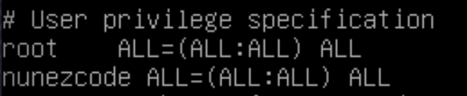

# Roger-Skyline-1
Configuring a secure web server :) 


# Network and Security Part

### You must create a non-root user to connect to the machine and work.
In my case, I created a non-root user while setting up the virtual machine. All I have to do is input the username and password.

### Use sudo, with this user, to be able to perform operation requiring special rights.
To achive this, first install sudo. In order to install sudo, One must be in root user:
```
$ su || type root credentials upon vm startup
$ apt-get update -y && apt-get upgrade -y
$ apt-get install sudo vim -y
```

I prefer to use vim but you can use nano which is installed in the vm by default.

Next the `/etc/sudoers` file needs to be updated. The username you created must be given sudo rights.
In root user:
```
$ nano /etc/sudoers
```
Notice that I used nano. In this case nano will be the easiest because if I wanted to use vim I would have to change the read/write permissions of the file.

By default, on line 20 You will see that the root user has access to all. You will want to add your user to this file.
In my case:

```
# User privilege specification
root  ALL=(ALL:ALL) ALL
nunezcode ALL=(ALL:ALL) ALL
```


Save the file and your new user now has sudo rights.

### We don’t want you to use the DHCP service of your machine. You’ve got to configure it to have a static IP and a Netmask in \30.

***1.*** First Things First, Open your VirtualBoxManager, Click on your current VM. Then click settings->Network-> On Adapter 1 change default NAT to Bridged Adapter.Then Save by clicking OK.

***2.*** Whilst on your sudo user: 
```
$ su - nunezcode (your user's username)
```
Type `ip addr` to check your changes. In my case, the name of my Bridged Adapter is `enp0s3` and just a couple lines under that, You will see its current ip address and its port.

Next We will configure its ip address by going into the interfaces file:

```
$ sudo vim /etc/network/interfaces
```

On line: 10 you should see the following:


Change the following lines with this:

```
auto enp0s3
```

The end result will look like this:


By doing this, You are telling the operating system that your configurations for the network `enp0s3` will be found inside the interfaces folder called `interfaces.d/`.

***4.*** Before adding the enp0s3 configurations, You will need to find the default gateway of host (Your lab computer). To get the gateway you need to run the following command on your host terminal:

```
$ netstat -rn
```


In my case my default gateway is 10.113.254.254 This will be vital to hours of debugging trying to find out why you can't establish connection to the internet and download packages for your virtual machine. So make sure you do this.


***3.*** Next create the file for your enp0s3 configurations inside the interfaces.d folder:

```
$ sudo vim /etc/network/interfaces.d/enp0s3
```

The file should look similar to this depending on the gateway of your host machine:


***4.*** After updating your enp0s3 you need to restart your network service in order for you changed to take effect: 

```
$ sudo service networking restart && ip addr 
```


As you can see on the image, The ip address of enp0s3 has changed to the one you put in your interface file. In my case 10.113.1.142. Also, The state of my network adapter seems to be down for some reason, If this happens to you, all you have to do is run the command: 

```
sudo ifup enp0s3
```

### You have to change the default port of the SSH service by the one of your choice. SSH access HAS TO be done with publickeys. SSH root access SHOULD NOT be allowed directly, but with a user who can be root.

***1.*** You will need to change the port of the ssh service. To change the default port you will have to update the `sshd_config` file:

```
$ sudo vim /etc/ssh/sshd_config
```

On line 13 you will see that the Port variable is commented out. Uncomment line 13 and change the number to one of your choice. In my case it will be 50550. You can set yours to what ever you want as long as it doesn't confict with any other ports on your machine. 
>Port numbers are assigned in various ways, based on three ranges: System Ports (0-1023), User Ports (1024-49151), and the Dynamic and/or Private Ports (49152-65535);


